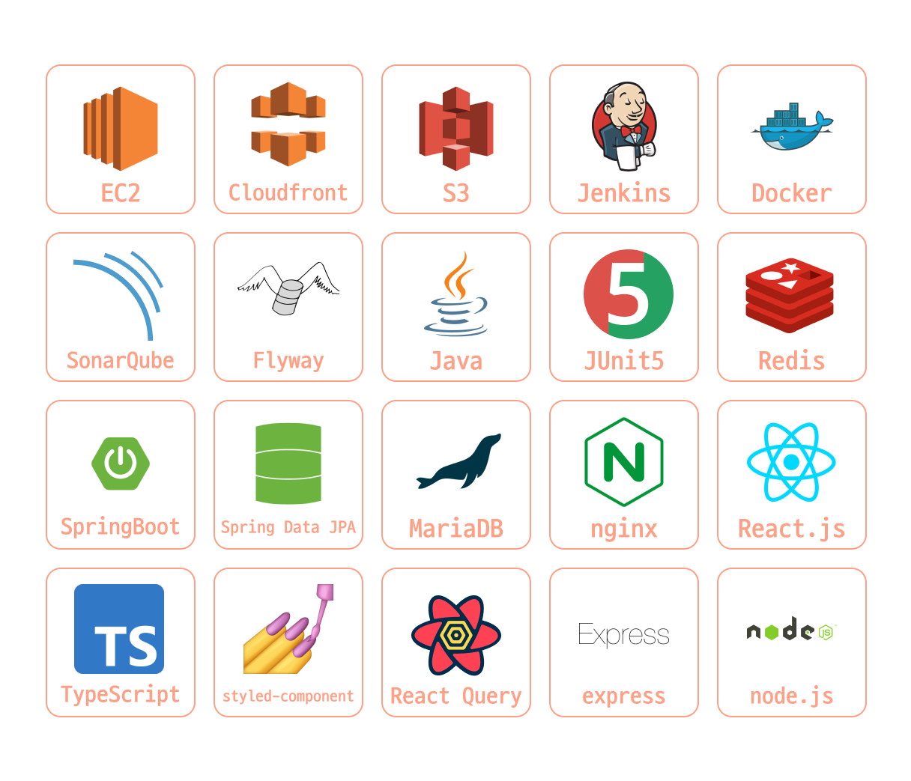
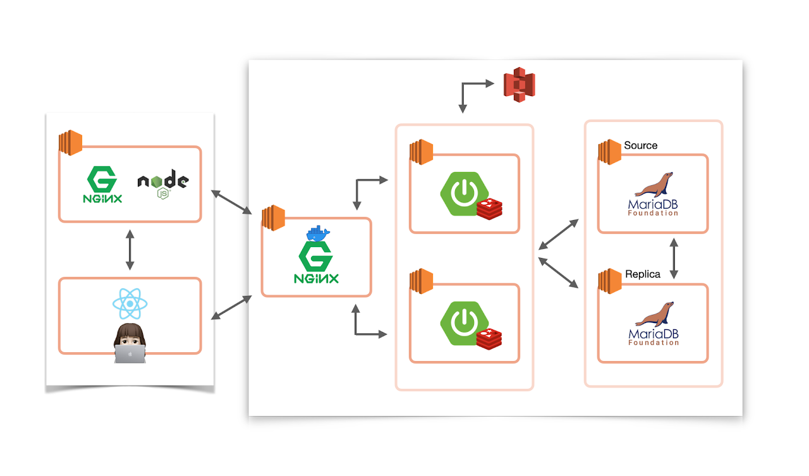
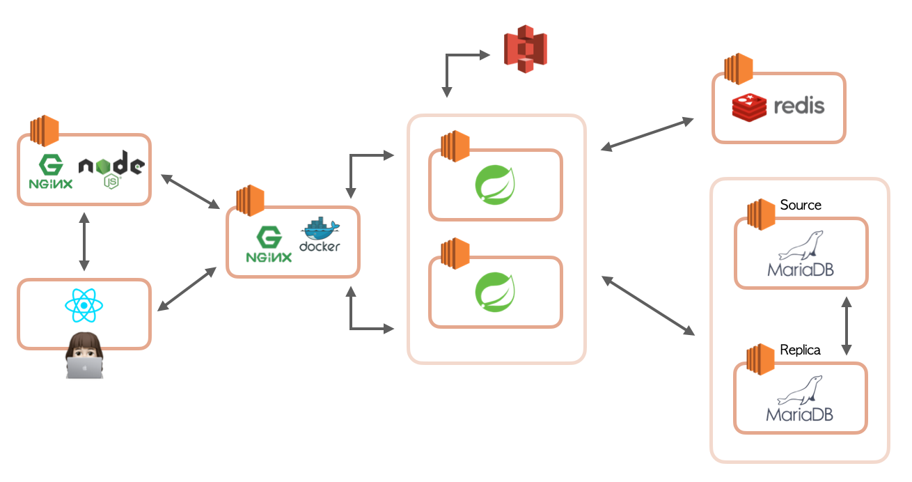
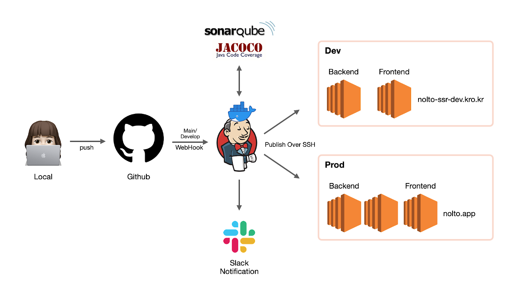

  
<h1 align="middle"> 🧸 놀토: 놀러오세요 토이프로젝트 🎈 </h1>

부담없이 자랑하는 작고 소중한 내 토이프로젝트

 서툰 프로젝트라도 누구나 뿌듯하게 자랑하고 공유하는 공간,

<h3 align="center"> 여기는 <b>놀토</b>입니다! </h3>

<h2 align="middle">🎥 놀토 소개 영상 </h2>

  

<h2 align="middle"> 🙋‍♀️ 놀토를 만든 사람들 🙋‍♂️</h2>

  
| [아마찌](https://github.com/NewWisdom)   |  [조엘](https://github.com/PapimonLikelion)  |   [포모](https://github.com/bosl95)      |  [미키](https://github.com/0307kwon)  | [지그](https://github.com/zigsong)   | [찰리](https://github.com/Gomding)   |
| :----------------------------------------------------------: | :----------------------------------------------------------: | :----------------------------------------------------------: | :----------------------------------------------------------: | :----------------------------------------------------------: | :----------------------------------------------------------: | 
|  |  |  |  |   |  |

 
 

<h2 align="middle"> 놀토에 사용된 기술 스택들 👨‍💻 </h2>

 

<h2 align="middle"> 놀토 인프라 구성 🎡 </h2>

- 21.11.08 이전 인프라 구조

  
- 21.11.08 이후 인프라 구조 
  
 

<h2 align="middle"> 놀토 CI/CD 프로세스 🎯 </h2>

 
 

<h2 align="middle"> ⚙️ 기술 스택 ⚙️ </h2>

   

  

      
  

       

 

